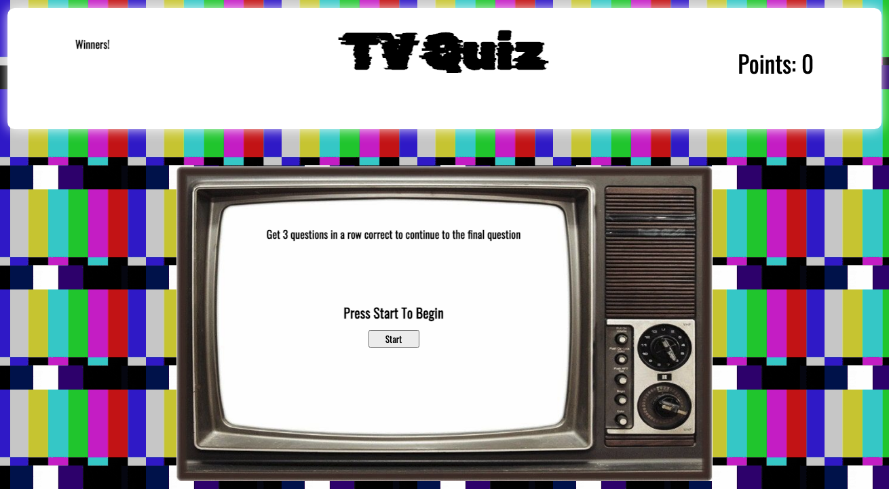
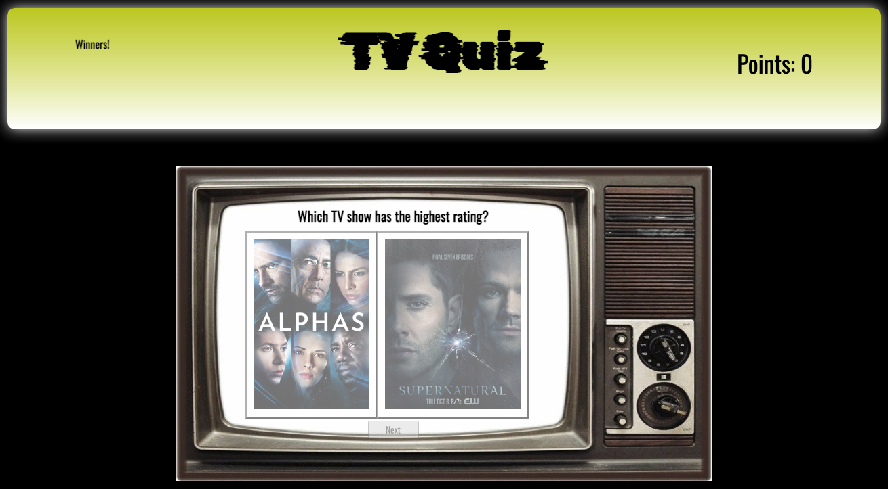

# TV Quiz
> Take the TV Quiz and see if you know which show is rated higher than the other!

## Table of contents
* [General info](#general-info)
* [Project Demo](#project-demo)
* [Project Video](#project-video)
* [Technologies](#technologies)
* [Setup](#setup)
* [Features](#features)
* [Inspiration](#inspiration)
* [Contact](#contact)
* [License](#license)

## General info
TV Quiz is a fun site to test your TV rating knowledge. If you get 3 in a row right, you move onto a final question where you'll have to answer a different question! This site was built using only vanilla JavaScript.

<div align="center">Welcome to BugView. </div>
<br/>
<div align="center">
<kbd>

</kbd>
</div>

<br/>
<div align="center">
<kbd>

</kbd>
</div>

## Project Demo 
[Click to try out TV Quiz] (https://dev.d2ouq1wrtwuczo.amplifyapp.com)
<!-- ## Project Video
[Click to view demo of TV Quiz]() -->

## Technologies

### Frontend Development 
* JavaScript
* HTML
* CSS

## Setup
To try out this project: 
1. Clone the GitHub repository locally to your computer
1. Open up index.html to your web browser and start playing!
1. If you want to keep track of the winners though, in your command line you can run $ json-server --watch db.json

## Code Examples

### JavaScript
```
fetch('https://api.tvmaze.com/shows')
.then(res => res.json())
.then(shows => {
    shows.forEach(show => {
        showIdArray.push(show.id)
        ratingArray.push(show.rating.average)
        showNameArray.push(show.name)
        genreArray.push(show.genres)
        imageArray.push(show.image.original)
        premiereArray.push(show.premiered)
    })
})
```


## Features
* Vanilla JavaScript web application.
* The TV Maze API is used for the data on the shows.
* Front-End styles were built with CSS. 
* Users can add their name/ID to the list of winners.


## Status
The project is finished, but a lot more can be built on top of it!

## Inspiration
The inspiration for TV Quiz came as my partner and I wanted to build a project that people have fun with. We decided to go with a quiz on TV shows that most of us are familiar with.

## Contact
Created by [Joseph Shin](https://www.linkedin.com/in/joseph-sw-shin/) 
Feel free to contact me for any questions! 

